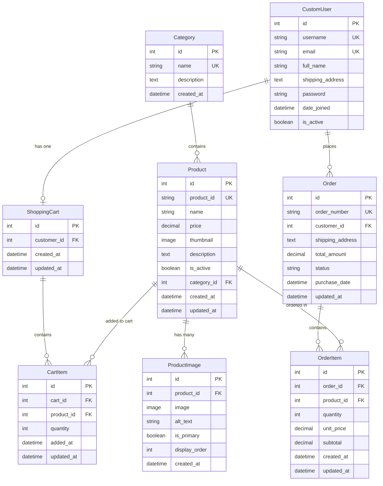

# Online Shopping System - ER Diagram

## Entity Relationship Diagram

## Entity Descriptions

### CustomUser
- **Primary Key**: id
- **Unique Keys**: username, email
- **Relationships**:
  - One-to-One with ShoppingCart
  - One-to-Many with Order

### Category
- **Primary Key**: id
- **Unique Keys**: name
- **Relationships**:
  - One-to-Many with Product

### Product
- **Primary Key**: id
- **Unique Keys**: product_id
- **Foreign Keys**: category_id → Category
- **Relationships**:
  - Many-to-One with Category
  - One-to-Many with ProductImage
  - One-to-Many with CartItem
  - One-to-Many with OrderItem

### ProductImage
- **Primary Key**: id
- **Foreign Keys**: product_id → Product
- **Relationships**:
  - Many-to-One with Product

### ShoppingCart
- **Primary Key**: id
- **Foreign Keys**: customer_id → CustomUser
- **Relationships**:
  - One-to-One with CustomUser
  - One-to-Many with CartItem

### CartItem
- **Primary Key**: id
- **Foreign Keys**: cart_id → ShoppingCart, product_id → Product
- **Unique Constraint**: (cart_id, product_id)
- **Relationships**:
  - Many-to-One with ShoppingCart
  - Many-to-One with Product

### Order
- **Primary Key**: id
- **Unique Keys**: order_number
- **Foreign Keys**: customer_id → CustomUser
- **Relationships**:
  - Many-to-One with CustomUser
  - One-to-Many with OrderItem

### OrderItem
- **Primary Key**: id
- **Foreign Keys**: order_id → Order, product_id → Product
- **Relationships**:
  - Many-to-One with Order
  - Many-to-One with Product

## Relationship Summary

| Relationship | Type | Description |
|-------------|------|-------------|
| CustomUser ↔ ShoppingCart | 1:1 | Each user has one shopping cart |
| CustomUser ↔ Order | 1:N | A user can place multiple orders |
| Category ↔ Product | 1:N | A category contains multiple products |
| Product ↔ ProductImage | 1:N | A product can have multiple images |
| Product ↔ CartItem | 1:N | A product can be in multiple cart items |
| Product ↔ OrderItem | 1:N | A product can be in multiple order items |
| ShoppingCart ↔ CartItem | 1:N | A cart contains multiple cart items |
| Order ↔ OrderItem | 1:N | An order contains multiple order items |
